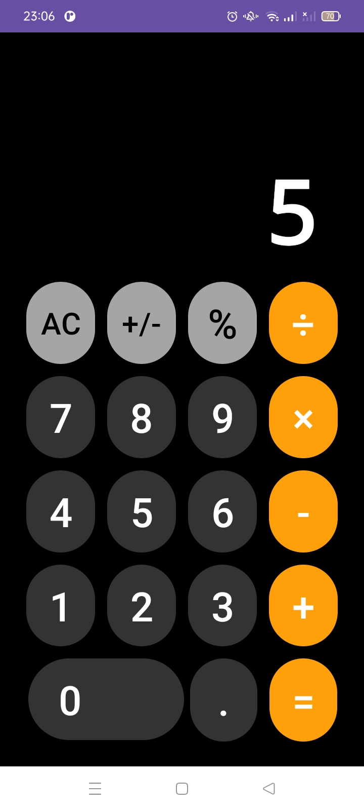
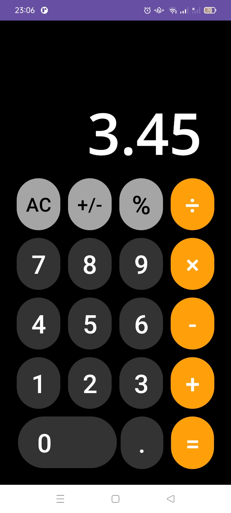

# MOBILE-PABCL2024

A user-friendly calculator project, drawing inspiration from the iPhone calculator, has been developed for assignment codelabs. Almost everything I coded is explained in the project code. The code is simple and easy to understand because it implies simple logic. If you have any further questions, please email me at the end of the description.
 
 

 
<h1>Built With 🛠</h1>
 
<ul>
  <li><a href="https://kotlinlang.org/">Kotlin</a>✅ - First class and official programming language for Android development.</li>
  <li><a href="https://developer.android.com/studio?gclid=CjwKCAiAzJOtBhALEiwAtwj8thOKLRSOeXXGGsTZlnY9DpSwK-Xnag7YE46YE8eTAPO2eUVaAZhncBoCmVgQAvD_BwE&gclsrc=aw.ds">Android Studio</a>✅ - official Integrated Development Environment (IDE) for Android app development.</li>
</ul>
 
<h1>Demo 🎬</h1>
This is a screenshot and video demo of the application when it is running:
 
 

  
https://github.com/xturus138/MOBILE-PABCL2024/assets/156584367/63ad89d8-da66-407c-8cbb-9df58dc79ce9

 
<h1>Feature ✨</h1>
<h3>advantages</h3>
<ul>
  <li>Can support more than 2 operations continuously</li>
  <li>The button already produces an iPhone clicking sound</li>
  <li>Uses lots of validation to avoid crashes (simple validation 😇)</li>
</ul>
<h3>Disadvantages</h3>
<ul>
  <li>For now it cannot accommodate more than 5 digit output numbers</li>
  <li>It is not yet perfect, therefore there may be undiscovered bugs</li>
</ul>

 

<h1>FAQ 🤔</h1>

#### Can I download it for my personal use?

You certainly can! If somebody want to making this calculator better, it would be great!. Perhaps we could have a chat ✨✨.

#### Are there any sanctions for copying your project?

No, but it would be greatly appreciated if you could make a brief mention of me 😊.

  
